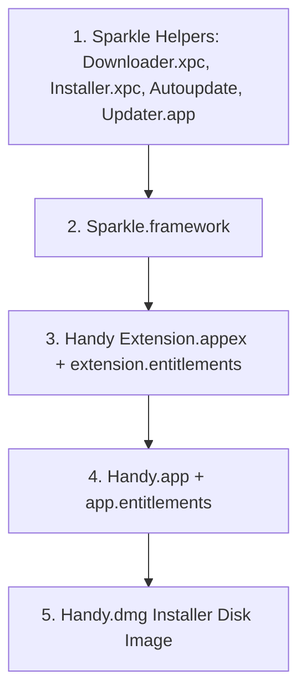

# Release Management & Signed Deployment Pipeline

This document details the release status, code signing requirements, Apple notarization, Sparkle auto-update mechanism, and deployment procedures for **Handy**.

---

## 1. Current Release Status

| Environment | Current Version | Code Signature Status | Notarization Status | Update Channel |
|---|---|---|---|---|
| **Production Release** | `1.0.0` | Developer ID Application Signed | Notarized & Stapled | GitHub Releases Sparkle Feed (`appcast.xml`) |
| **Local Development** | `1.0.0` | Ad-hoc (`-`) | N/A | N/A |

- **Version File**: [VERSION](file:///Users/brandontruong/Documents/Personal/handy-signed/VERSION) (Single Source of Truth)
- **GitHub Repository**: `IsaacYeung/Handy`
- **Stable Download URL**: `https://github.com/IsaacYeung/Handy/releases/latest/download/Handy.dmg`
- **Sparkle Appcast Feed**: `https://github.com/IsaacYeung/Handy/releases/latest/download/appcast.xml`

---

## 2. Code Signing Architecture & Certificate Setup

macOS ties TCC security permissions (Accessibility, Automation, FinderSync Extensions) directly to the code signature. 

### 2.1 Ad-Hoc Signing vs. Developer ID Signing
- **Ad-Hoc Signing (`SIGNING_IDENTITY="-"`)**: Default for local builds. Every code compilation produces a new unique hash, causing macOS to treat each rebuild as an unverified new application. TCC permissions reset on every reinstall.
- **Developer ID Application Signing**: Certificate issued by Apple. Hardened Runtime and secure timestamps are enabled. Permissions persist across app updates, and Gatekeeper warnings are eliminated.

### 2.2 Developer ID Certificate Info
On the release build machine, the official Tsuga Digital Inc. Developer ID certificate is installed:
```text
Developer ID Application: Tsuga Digital Inc. (UJ82R55UPL)
SHA-1 Fingerprint: 3E901352041D52C4625F6D37ADEEAD3A6AD00CBA
```

### 2.3 Inside-Out Signing Sequence
Code signing MUST be performed inside-out to prevent deep strict verification failures (`codesign --verify --strict --deep`):



---

## 3. Apple Notarization Workflow

Notarization ensures Gatekeeper permits the app to launch on end-user Macs without security overrides.

### 3.1 Initial One-Time Credentials Setup
Store Apple Developer notary credentials in macOS Keychain using [scripts/setup-apple-signing.sh](file:///Users/brandontruong/Documents/Personal/handy-signed/scripts/setup-apple-signing.sh):
```bash
scripts/setup-apple-signing.sh
```
This stores profile `handy-notary-tsuga` in `xcrun notarytool`.

### 3.2 Automated Notarization Pipeline
During build/release with `NOTARIZE=1`, [build.sh](file:///Users/brandontruong/Documents/Personal/handy-signed/build.sh) executes:
1. `xcrun notarytool submit Handy.dmg --keychain-profile handy-notary-tsuga --wait`
2. `xcrun stapler staple Handy.dmg` (Attaches ticket directly to the disk image for offline validation)
3. `xcrun stapler validate Handy.dmg`
4. `spctl -a -t open --context context:primary-signature -v Handy.dmg` (Gatekeeper verification)

---

## 4. Sparkle EdDSA Auto-Update System

Handy incorporates the Sparkle 2 framework (`SPSparkle.framework` v2.9.3) vendored in `vendor/Sparkle`.

### How Updates Work
1. The app periodically checks `appcast.xml` on GitHub Releases.
2. Sparkle verifies the cryptographic EdDSA signature of the downloaded `.dmg` using the public key embedded in [Sources/App/Info.plist](file:///Users/brandontruong/Documents/Personal/handy-signed/Sources/App/Info.plist) (`SUPublicEDKey`).
3. Private key signing is performed during `release.sh` execution via `vendor/Sparkle/bin/generate_appcast`.

---

## 5. Step-by-Step Release Deployment Guide

To deploy a new official signed release to users:

### Step 1: Bump Version Number
Update the version string in [VERSION](file:///Users/brandontruong/Documents/Personal/handy-signed/VERSION):
```bash
echo "1.1.0" > VERSION
```

### Step 2: Commit All Changes
`release.sh` strictly enforces clean git working tree state to guarantee release reproducibility:
```bash
git add -A && git commit -m "Release 1.1.0"
```

### Step 3: Run Automated Release Script
Execute [release.sh](file:///Users/brandontruong/Documents/Personal/handy-signed/release.sh) with signing identity and notarization enabled:
```bash
SIGNING_IDENTITY="3E901352041D52C4625F6D37ADEEAD3A6AD00CBA" \
NOTARY_PROFILE=handy-notary-tsuga \
NOTARIZE=1 \
bash release.sh
```

### Step 4: Verification of Published Release
[release.sh](file:///Users/brandontruong/Documents/Personal/handy-signed/release.sh) automatically:
1. Runs full type-checking and unit tests.
2. Compiles production binaries and FinderSync extension.
3. Stamps version into all `Info.plist` files.
4. Signs binaries inside-out with Hardened Runtime enabled.
5. Packages styled installer `Handy.dmg`.
6. Submits `Handy.dmg` to Apple Notary Service and staples ticket.
7. Signs update payload with Sparkle EdDSA private key and regenerates `releases/appcast.xml`.
8. Publishes GitHub Release `v1.1.0` via `gh release create` uploading `Handy-1.1.0.dmg`, `Handy.dmg`, and `appcast.xml`.
